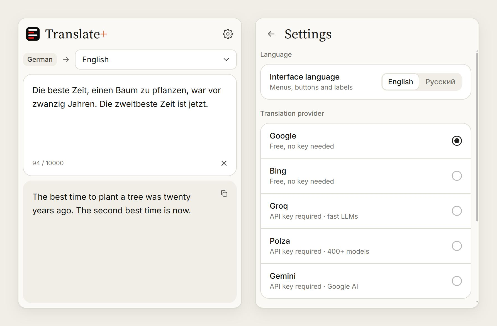

<p align="center">
  
</p>

<h1 align="center">Translate+</h1>

<p align="center">
  <b>English</b> · <a href="README.ru.md">Русский</a>
</p>

Translate+ is a browser translator extension. Select text on any page and get the translation right away, from Google, Bing or an AI model (Groq, Gemini, Polza). It works in Chromium-based browsers (Chrome, Edge, Brave, Opera, Vivaldi and others) and in Firefox-based ones (Firefox, Waterfox, LibreWolf, Floorp, Zen).

<p align="center">
  
</p>

## Features

- **Translate a selection.** Select text and a small logo appears at its end; click it, or the extension's toolbar button, and the window opens with the text already translated. Text taken from a page shows only its translation, without the input box.
- **Translate in place.** Hold Shift and click the logo: the translation replaces the selected text right on the page. Paragraphs, list items and table cells keep their places; links and bold text inside a translated paragraph become plain text. In text fields and editors the translation goes in as if it were typed. Ctrl+Z brings the original back. Up to 20,000 characters at a time.
- **Plain translator.** Type or paste text into the window and the translation appears a moment later. The last text you typed is kept until the browser closes.
- **Source language is detected automatically;** the target language is picked on the main screen (English by default).
- **Five providers:** Google and Bing need no key; Groq, Gemini and Polza use your own API key and let you pick any model that takes and returns text. Settings show under each AI provider whether its key is set.
- **English and Russian interface,** switched in Settings → Language.
- **Light and dark theme** in the claude.ai style.

## Installation

### Chrome, Edge and other Chromium browsers

1. Download **`translate-plus-chromium.zip`** from the [latest release](https://github.com/neodym121/translate-plus/releases/latest) and unzip it. Keep the `translate-plus-chromium` folder somewhere permanent: the browser loads the extension from it.
2. Open the extensions page: `chrome://extensions` in Chrome, `edge://extensions` in Edge, `brave://extensions` in Brave, `opera://extensions` in Opera, `vivaldi://extensions` in Vivaldi.
3. Turn on **Developer mode** (a switch in the top right corner; in Edge, in the left panel).
4. Click **Load unpacked** and choose the `translate-plus-chromium` folder (the one with `manifest.json` inside).
5. Pin Translate+ to the toolbar from the puzzle-piece menu, and reload the tabs that were already open.

**Updating:** download the new release, replace the contents of the folder, and press the reload button (↻) on the extension's card.

### Firefox and other Gecko browsers

Version 140 or newer.

1. Download **`translate-plus-firefox.xpi`** from the [latest release](https://github.com/neodym121/translate-plus/releases/latest). The file is signed by Mozilla.
2. Open `about:addons`, click the gear ⚙ and choose **Install Add-on From File…**, then pick the file. Dragging the file onto the browser window works too.
3. Confirm the install. Translate+ asks for access to all websites: the selection icon needs it on every page, and the translation services are reached through it.
4. Pin Translate+ to the toolbar from the puzzle-piece menu, and reload the tabs that were already open.

**Updating:** the browser installs new versions by itself. To check right away: `about:addons` → ⚙ → **Check for Updates**.

If site access gets switched off in the add-on's permissions, the window shows a notice with an **Allow** button.

The selection icon doesn't appear where browsers don't let extensions in (`chrome://` and `about:` pages, the Chrome Web Store and addons.mozilla.org, the built-in PDF viewer). There, open the window from the toolbar and paste the text.

## Translation providers

| Provider | Key | Notes |
|---|---|---|
| Google | not needed | Google Translate's public endpoint |
| Bing | not needed | Bing's web translator; long text is split into 1000-character parts automatically |
| Groq | [needed](https://console.groq.com/keys) | fast open models (Llama, gpt-oss, Qwen…), grouped by developer |
| Gemini | [needed](https://aistudio.google.com/apikey) | Google AI Studio: Gemini and Gemma models |
| Polza | [needed](https://polza.ai/dashboard/api-keys) | 300+ text models from every developer in one searchable list (Qwen3.5 9B by default); below it, the sub-provider: the service that runs the chosen model, with its prices, or "Automatic" |

For the AI providers, the model list comes from the provider's API (when you enter the key, with the ↻ button, and once a day by itself). Models that can't answer in text, such as speech, image, embedding and moderation models, are left out. Long lists (models, languages) have a search box.

**Privacy.** API keys are stored only in this browser's `chrome.storage.local` and are sent only to the chosen provider. Text goes only to the provider you picked.

## Development

The extension is plain JavaScript with no build step: `extension/` is the Chromium extension itself, `gecko-extension/` the Firefox one. The Firefox folder is a copy with its own manifest and a few changes of its own; the tests check that every other file stays identical in both.

```bash
node --test tests/lib.test.mjs          # text splitting and the providers against a mock server
LIVE=1 node --test tests/lib.test.mjs   # plus real requests to Google and Bing
node tests/dev-server.mjs               # the window in an ordinary tab: http://localhost:5173/popup/popup.html
                                        # the selection icon and in-place translation: http://localhost:5173/__page
node tests/dev-server.mjs 5174 gecko-extension   # the same for the Firefox folder
npx web-ext lint --self-hosted --source-dir gecko-extension   # Mozilla's checks for the Firefox build
node tools/make-icons.mjs               # rebuild extension/icons/icon*.png from the logo geometry
```

Fonts: [Inter](https://rsms.me/inter/) and [Source Serif 4](https://github.com/adobe-fonts/source-serif), SIL Open Font License (`extension/popup/fonts/`).

## Credits

Made by [neodym121](https://github.com/neodym121) together with [Claude](https://claude.com/claude-code) (Anthropic).

## License

[MIT](LICENSE)
