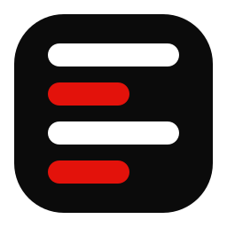
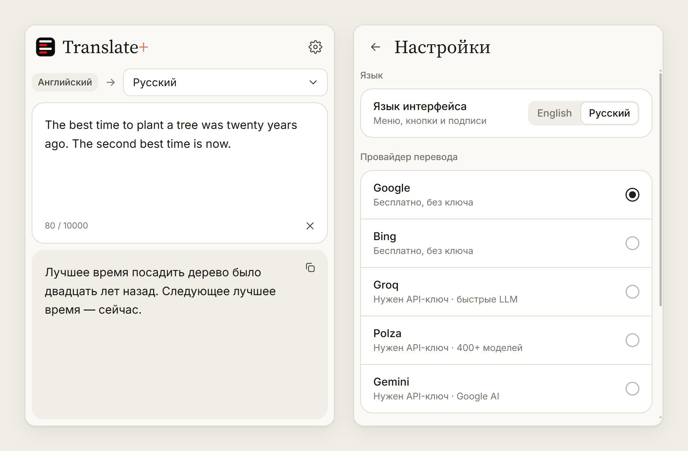

<p align="center">
  
</p>

<h1 align="center">Translate+</h1>

<p align="center">
  <a href="README.md">English</a> · <b>Русский</b>
</p>

Translate+ — браузерное расширение-переводчик. Выделите текст на любой странице и сразу получите перевод от Google, Bing или ИИ-модели (Groq, Gemini, Polza). Работает в браузерах на Chromium: Chrome, Edge, Brave, Opera, Vivaldi и других.

<p align="center">
  
</p>

## Возможности

- **Перевод выделенного.** Выделите текст — у его конца появится маленький логотип. Клик по нему или по кнопке расширения на панели открывает окно, текст в нём уже переведён. Когда текст пришёл со страницы, окно показывает только перевод, без поля ввода.
- **Перевод на месте.** Зажмите Shift и кликните по логотипу — перевод встанет прямо на страницу вместо выделенного текста. Абзацы, пункты списков и ячейки таблиц остаются на своих местах; ссылки и жирный текст внутри переведённого абзаца становятся обычным текстом. В полях ввода и редакторах перевод вставляется так, будто его набрали с клавиатуры. Ctrl+Z возвращает оригинал. За один раз — до 20 000 символов.
- **Обычный переводчик.** Введите или вставьте текст в окно — перевод появится через долю секунды. Последний набранный текст хранится до закрытия браузера.
- **Язык исходного текста определяется сам;** язык перевода выбирается на главном экране (по умолчанию английский).
- **Пять провайдеров:** Google и Bing работают без ключа; Groq, Gemini и Polza — с вашим API-ключом, модель можно выбрать любую из тех, что принимают и выдают текст. В настройках под каждым ИИ-провайдером видно, задан ли для него ключ.
- **Интерфейс на английском и русском,** переключается в Настройки → Язык.
- **Светлая и тёмная тема** в стиле claude.ai.

## Установка

1. Скачайте **`translate-plus-chromium.zip`** из [последнего релиза](https://github.com/neodym121/translate-plus/releases/latest) и распакуйте. Папку `translate-plus-chromium` положите туда, где она останется: браузер загружает расширение прямо из неё.
2. Откройте страницу расширений: `chrome://extensions` в Chrome, `edge://extensions` в Edge, `brave://extensions` в Brave, `opera://extensions` в Opera, `vivaldi://extensions` в Vivaldi.
3. Включите **«Режим разработчика»** (переключатель справа вверху; в Edge — на левой панели).
4. Нажмите **«Загрузить распакованное расширение»** и выберите папку `translate-plus-chromium` (ту, в которой лежит `manifest.json`).
5. Закрепите Translate+ на панели через меню с пазлом и обновите вкладки, которые уже были открыты.

**Обновление:** скачайте новый релиз, замените содержимое папки и нажмите кнопку обновления (↻) на карточке расширения.

Значок у выделения не появляется там, куда браузер не пускает расширения (страницы `chrome://`, Chrome Web Store, встроенный просмотр PDF). Там откройте окно кнопкой на панели и вставьте текст.

## Провайдеры перевода

| Провайдер | Ключ | Заметки |
|---|---|---|
| Google | не нужен | публичный эндпоинт Google Translate |
| Bing | не нужен | веб-переводчик Bing; длинный текст сам режется на части по 1000 символов |
| Groq | [нужен](https://console.groq.com/keys) | быстрые открытые модели (Llama, gpt-oss, Qwen…), сгруппированы по разработчику |
| Gemini | [нужен](https://aistudio.google.com/apikey) | Google AI Studio: модели Gemini и Gemma |
| Polza | [нужен](https://polza.ai/dashboard/api-keys) | 300+ текстовых моделей всех разработчиков в одном списке с поиском (по умолчанию Qwen3.5 9B); ниже — субпровайдер: сервис, на котором работает выбранная модель, с ценами, или «Автоматически» |

У ИИ-провайдеров список моделей берётся из их API (при вводе ключа, по кнопке ↻ и сам раз в сутки). Модели, которые не умеют отвечать текстом — речь, картинки, эмбеддинги, модерация, — в список не попадают. В длинных списках (модели, языки) есть поиск.

**Приватность.** API-ключи хранятся только в `chrome.storage.local` этого браузера и уходят только выбранному провайдеру. Текст тоже уходит только выбранному провайдеру.

## Разработка

Расширение написано на чистом JavaScript без сборки: папка `extension/` — это и есть расширение.

```bash
node --test tests/lib.test.mjs          # разбивка текста и провайдеры на mock-сервере
LIVE=1 node --test tests/lib.test.mjs   # плюс реальные запросы к Google и Bing
node tests/dev-server.mjs               # окно в обычной вкладке: http://localhost:5173/popup/popup.html
                                        # значок и перевод на месте: http://localhost:5173/__page
node tools/make-icons.mjs               # пересобрать extension/icons/icon*.png из геометрии логотипа
```

Шрифты: [Inter](https://rsms.me/inter/) и [Source Serif 4](https://github.com/adobe-fonts/source-serif), лицензия SIL Open Font License (`extension/popup/fonts/`).

## Авторы

Сделано [neodym121](https://github.com/neodym121) вместе с [Claude](https://claude.com/claude-code) (Anthropic).

## Лицензия

[MIT](LICENSE)
